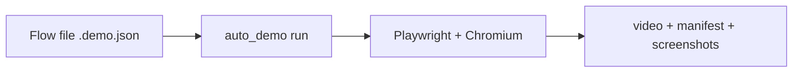

<div align="center">
<picture>
  <source media="(prefers-color-scheme: dark)" srcset="docs/brand/auto_demo-wordmark-dark.png">
  <source media="(prefers-color-scheme: light)" srcset="docs/brand/auto_demo-wordmark-light.png">
  
</picture>

#### deterministic flow replay · Playwright video capture · AI voice narration · vertical and split exports · animated SVG heroes · re-record on every deploy

# Demo recorder: one flow file in, deterministic video out

**[Quick start](#-quick-start) | [Features](#-features) | [Modes](#modes) | [Widget demos](#-elevenlabs-widget-demos) | [Watch mode](#-watch-mode) | [License](#license)**

### [🎬 Record your first demo → Quick start](#-quick-start)

No LLM at record time: the flow file drives the browser, not a model.

**❤️ [Sponsor this project](https://github.com/sponsors/wranngle) ❤️**

[](https://github.com/wranngle/auto_demo/actions/workflows/ci.yml)
[](LICENSE)
[](https://github.com/wranngle/auto_demo/commits/main)
[](https://github.com/wranngle/auto_demo/graphs/contributors)

[](https://github.com/wranngle/auto_demo/stargazers)
[](https://github.com/wranngle)
</div>

---


You check a demo flow file into the repo; **auto_demo** replays it with Playwright and writes a reproducible video, screenshots, and a manifest. AI may author or repair the flow file; it never drives the recording run. Nine subcommands share one flow schema with fourteen step actions, so the same `.demo.json` that records your hero also feeds narration, vertical cuts, split-screen reviews, and storyboards.

```bash
npm run demo:smoke
# → .work/smoke-demo/recording.webm + manifest.json + screenshots/
```

## Why this exists

screencli is the obvious alternative, but it forces hosted GitHub-login auth on first run unless an Anthropic API key is already configured, and either way its AI runs in the cloud, which fails the bar for unattended repo-local recording. Playwright is deterministic and local, with browser control and video capture built in, so the recording run needs no login and no cloud call.

## 🎬 Features

- 🎬 **Deterministic recording**: `run` replays a checked-in `.demo.json` with a visible cursor, click pulses, cinematic zooms, and on-video captions, then retimes the webm to real-time playback.
- 🗣️ **AI narration mux**: `narrate` lays a voiceover onto an existing recording; real ElevenLabs TTS with a key, a deterministic mock tone without one.
- 💬 **Widget demos**: `widget` compiles 7 shipped scenarios into business landing pages with a live ElevenLabs chat widget, recorded through the widget's real text-mode selectors.
- 📱 **Vertical export**: `vertical` re-frames any recording into a 1080x1920 MP4, center-crop or letterbox.
- 🪞 **Split-screen review**: `split` renders the flow's step list beside the recording for frame-by-frame walkthroughs.
- 🖼️ **Animated SVG heroes**: `svg` emits a self-contained animated SVG under a 200KB ceiling, embeddable in a README without binary asset hosting.
- 📝 **Storyboards and scripts**: `storyboard` writes a markdown summary of a recorded run; `from-url` drafts a 5-step script from a URL and a plain-English goal.
- 👀 **Change detection**: `watch --once` hashes DOM snapshots and fires a re-run hook only when the UI actually changed.
- ⚙️ **CI re-recording**: a shipped GitHub Actions template re-records the demo on every push to `main`.



## 🚀 Quick start

1. Install and build:

   ```bash
   git clone https://github.com/wranngle/auto_demo && cd auto_demo
   npm install
   npx playwright install chromium
   npm run build
   ```

   The npm package name is `ui-demo-runner` (see `package.json`); it is not published to the registry, so install and run it from this repo's source.

2. Put `ffmpeg` + `ffprobe` on `PATH` (`apt install ffmpeg` / `brew install ffmpeg`). The recorder calls them to (a) re-time every webm to real-time playback (Playwright tags recordings at 25 fps while capturing ~75 fps of real frames, so without this step recordings play back 3-5x slow) and (b) power `narrate`, `vertical`, `split`, and `svg`. If ffmpeg is missing, `run` still records and writes `manifest.json`; only the recording retiming is skipped. The `narrate`, `vertical`, `split`, and `svg` subcommands require ffmpeg/ffprobe and fail without them.

3. Record your own app. Create a `*.demo.json` beside it, then run it:

   <details>
   <summary>Example flow file: <code>console-overview.demo.json</code></summary>

   ```json
   {
     "name": "console-overview",
     "startUrl": "http://127.0.0.1:5177/console/",
     "viewport": {
       "width": 1280,
       "height": 720
     },
     "steps": [
       {
         "action": "waitForText",
         "text": "Pipeline Console"
       },
       {
         "action": "click",
         "selector": "text=Opportunities",
         "label": "Open opportunity review"
       },
       {
         "action": "screenshot",
         "name": "opportunity-review"
       }
     ]
   }
   ```

   </details>

   ```bash
   node dist/cli.js run path/to/console-overview.demo.json \
     --output output/console-overview \
     --speed 1.25
   ```

Relative `startUrl` and `goto.url` values resolve against the flow file's directory. With `--base-url`, relative URLs resolve against that local dev server.

Two more `run` flags worth knowing:

- `--quality 720p | 1080p | 4k` sets the capture viewport and re-encodes the recording at the preset's bitrate target during post-process; the manifest's `retime` block records what was applied (or why the post-process failed).
- `--captions-lang en,es,pt,fr` exports one SRT caption track per language beside the recording, cue-timed to the flow's `timing.speed`.

## Run the smoke demo

```bash
npm run demo:smoke
```

The run writes:

- `.work/smoke-demo/recording.webm`: the retimed video
- `.work/smoke-demo/manifest.json`: per-step snapshot of the whole run
- `.work/smoke-demo/events.jsonl`: one structured line per step
- `.work/smoke-demo/screenshots/opportunity-review.png`: the flow's screenshot step

## 📦 What one run emits

<table>
<tr>
<td align="center" width="33%"><b><code>recording.webm</code></b><br/>the retimed Playwright video</td>
<td align="center" width="33%"><b><code>manifest.json</code></b><br/>per-run snapshot of every step</td>
<td align="center" width="33%"><b><code>events.jsonl</code></b><br/>one structured NDJSON line per step</td>
</tr>
<tr>
<td align="center" width="33%"><b><code>screenshots/*.png</code></b><br/>a named PNG per screenshot step</td>
<td align="center" width="33%"><b><code>*.srt</code></b><br/>optional per-language caption tracks</td>
<td align="center" width="33%"><b>...from one flow file</b><br/>rerun it after every UI change</td>
</tr>
</table>

*Every artifact from one flow file.*

## 🎯 Heroes shot with auto_demo

| Repo | What it recorded |
| --- | --- |
| [gtm_ops](https://github.com/wranngle/gtm_ops) | 11-step pipeline replay into its README hero |
| [orb_forge](https://github.com/wranngle/orb_forge) | the live WebGL orb, captured headless |
| [wranngle_com](https://github.com/wranngle/wranngle_com) | the live landing page, compressed to an animated webp |
| ...any repo with a URL | point a `.demo.json` at it |

*Three sibling heroes recorded by this CLI.*

Named repos are usage examples, not integrations.

## Modes

- `goto`: navigate to another URL.
- `caption`: show a short on-video caption for a timed beat.
- `waitForText`: wait until visible text appears.
- `waitForSelector`: wait until a selector is visible.
- `focus`: move the cursor to a selector and smoothly zoom toward it.
- `resetZoom`: return from a focus or zoom beat to full-frame context.
- `click`: click a selector with a visible cursor pulse.
- `fill`: fill a field.
- `hover`: hover a selector.
- `press`: press a keyboard key, optionally scoped to a selector.
- `scroll`: scroll by pixel delta.
- `pause`: wait for a fixed number of milliseconds.
- `zoom`: animate a cinematic punch-in to (x, y) at the given scale over durationMs.
- `screenshot`: write a PNG artifact.

## 🗣️ Narrate (AI voice mux)

`ui-demo-runner narrate` muxes a voiceover track onto an existing recording. The default `--voice mock` synthesizes a deterministic sine tone per line so tests never hit the network. `--voice elevenlabs` performs real ElevenLabs TTS: it reads `ELEVENLABS_API_KEY`, synthesizes each line with the voice from `--voice-id`, and backs off exponentially on 429/5xx before failing. Without a key it falls back to the deterministic mock tone; the JSON result's `voice` field always reports what actually ran.

```bash
node dist/cli.js narrate \
  --script fixtures/short-script.txt \
  --in output/console-overview/recording.webm \
  --out output/console-overview/narrated.mp4 \
  --voice mock
```

Script format is one line per cue: `start_sec | duration_sec | text`. Lines beginning with `#` and blank lines are ignored. The output MP4 carries the original video track plus a single AAC audio track (`ffprobe` reports both).

## 📱 Vertical export (9:16)

`ui-demo-runner vertical` converts an existing recording into a 9:16 (1080x1920) MP4 for phone-native vertical feeds. The default `--fit crop` center-crops the source frame; `--fit pad` letterboxes the source onto a black 9:16 canvas instead. The video track is re-encoded to H.264 with `+faststart`; the audio track is stripped (mux narration on top separately if needed).

```bash
node dist/cli.js vertical \
  --in output/console-overview/recording.webm \
  --out output/console-overview/short.mp4 \
  --aspect 9:16 \
  --fit crop
```

`ffprobe` on the output reports `width=1080,height=1920` (ratio ~0.5625).

## 📝 Generate a script from a URL (mock LLM)

For ideation, `from-url` produces a deterministic 5-step script from a URL + plain-English goal. The default client is a deterministic mock backed by a checked-in fixture, so tests and offline runs are stable.

```bash
node dist/cli.js from-url https://example.com/billing \
  --goal "show how to add a credit card" \
  --out out/credit-card.script.json \
  --narration-out out/credit-card.narration.txt
```

Every step in the emitted `steps[]` carries `selector`, `action`, and `narration`: the contract that downstream `run` and `narrate` consume. `--narration-out` writes the bridge for the narrate half: a `start | duration | text` script with one cue per step, slot-timed by reading speed, ready for `narrate --script` (mock tone or ElevenLabs).

## 💬 ElevenLabs widget demos

`ui-demo-runner widget` compiles a `*.scenario.json` into a business landing page with an `<elevenlabs-convai>` chat widget plus the matching `.demo.json` flow. One scenario, two modes (`live` block present = real agent; absent = mock), both driven through the real widget's text-mode selectors.

```bash
node scripts/provision-agents.mjs        # idempotent: create/reuse 7 demo agents
node scripts/tune-agents.mjs             # PATCH each agent: markdown reply + client tools + branded text-contents
node scripts/record-live-demos.mjs       # record all 7 → output/live-widget/
```

Seven shipped scenarios under `examples/widget/`: six vertical demos (restaurant, dental, salon, ecommerce, medspa, home-services) plus a dedicated SaaS **wranngle-scheduling** scenario that exercises the real Cal.com `book_demo` webhook end-to-end (the only scenario whose recording creates a real Cal.com entry). Each `live` block tunes the widget per business: orb gradient, `branding.{mainLabel,startCall}` → widget `text-contents`, `linkHosts` → `markdown-link-allowed-hosts`, and `clientTools[]` declares browser-side tools (name, description, params, canned `result`). The page registers the canned handlers via the `elevenlabs-convai:call` event; the real agent's LLM decides to call a tool, it runs in-page with **no backend, no side effects**, returns the canned result, and the agent speaks it as rich markdown (a bold heading + bulleted detail list + a clickable confirmation link). Live recordings are choreographed for motion: a zoom punch anchored at the widget's bottom-right corner held while the reply streams, then a pull-back.

`live.workspaceToolIds: string[]` attaches existing ElevenLabs workspace tools by id (e.g. the native Cal.com `book_demo` webhook). **These take real actions** when invoked: real Cal.com bookings, real SMS. `tune-agents.mjs` merges them onto the agent's `prompt.tool_ids` (the API rejects sending inline `tools` + `tool_ids` together). Only the **wranngle-scheduling** scenario ships with the real Cal.com `book_demo` attached; re-recording it may create a real booking if the conversation reaches that tool. The six vertical scenarios use client-tool mocks exclusively; recording them is side-effect-free.

## 🖼️ Animated SVG export (README hero)

`ui-demo-runner svg` samples frames from an existing MP4 and emits a single self-contained animated SVG suitable for embedding directly in a README: the same surface as `docs/hero.gif` from the hero block, but as inline markup that renders without binary asset hosting.

```bash
node dist/cli.js svg \
  --fixture examples/fixtures/short-clip.mp4 \
  --out out/demo.svg
```

The output is a single `.svg` file with base64-embedded JPEG frames driven by SMIL `<animate>` elements. The renderer enforces a 200KB ceiling so the file stays cheap to ship alongside the README; tune `--frames`, `--width`, or `--jpeg-quality` if the budget is tight.

## 🪞 Split-screen export (flow + recording side-by-side)

`ui-demo-runner split` renders a 1920x1080 MP4 with the flow's step list on the left and an existing recording on the right: internal review clip for walking a teammate through what each step actually does, frame by frame.

```bash
node dist/cli.js split \
  path/to/flow.demo.json \
  output/console-overview/recording.webm \
  --output output/console-overview/split.mp4
```

The flow panel renders each step as a captioned card; the recording panel plays the source MP4 timed against the same per-step window. Scratch frames land under `.ui-demo-runner-split/` (gitignored) and are cleaned up on completion; pass an explicit `--work-dir` to keep them for inspection.

## 📋 Storyboard (markdown summary of a recorded run)

`ui-demo-runner storyboard` walks a recorded run's `manifest.json` and emits a markdown `storyboard.md` beside it: one row per step with the screenshot artifact thumbnail and the narration text. Useful for PR descriptions, async review, and dropping a flat summary into a doc without re-running the demo.

```bash
node dist/cli.js storyboard output/console-overview
# → output/console-overview/storyboard.md
```

## ✨ Polish controls

Flow files can opt into the recording style used for portfolio demos:

```json
{
  "timing": {
    "speed": 1.25,
    "moveMs": 180,
    "clickPauseMs": 160,
    "zoomMs": 360
  },
  "polish": {
    "cursor": {
      "style": "modern",
      "accentColor": "#ff5f00"
    },
    "actionRail": {
      "enabled": true
    },
    "captions": {
      "enabled": true,
      "position": "bottom"
    },
    "zoom": {
      "defaultScale": 1.06,
      "durationMs": 360,
      "resetMs": 260
    }
  }
}
```

Use the action rail for internal review clips and dense walkthroughs where the viewer needs to see the planned sequence. Turn it off for final public exports if it competes with the product UI.

## ⚙️ CI integration: re-record on every deploy

Drop in the shipped GitHub Actions template so every push to `main` produces a fresh `recording.webm` + `manifest.json` as a workflow artifact:

```bash
mkdir -p .github/workflows
cp templates/auto-demo-on-deploy.yml.template \
   .github/workflows/ui-demo-runner-on-deploy.yml
git add .github/workflows/ui-demo-runner-on-deploy.yml
```

Edit the copied workflow to point at your own `flows/<name>.demo.json` and commit. Artifacts land under the workflow run as `ui-demo-runner-<sha>`.

## 👀 Watch mode

Re-record only when the UI actually changes. `watch --once` hashes the previous and next DOM snapshots, emits `CHANGE_DETECTED` (or `NO_CHANGE`), and fires a re-run hook exactly once per detected change. `--once` is the only mode wired today; wire a polling loop on top via your scheduler or a CI scheduled workflow that re-runs this command against your latest DOM snapshot.

```bash
node dist/cli.js watch --once \
  --fixture fixtures/old-dom.html \
  --next fixtures/new-dom.html
```

## 🗺️ Roadmap

| Surface | Status |
| --- | --- |
| Recorder core: `run`, retiming, quality presets, captions | Shipped |
| `narrate`: ElevenLabs TTS + deterministic mock | Shipped |
| `widget`: 7 scenarios, live agent + mock | Shipped |
| `vertical`, `split`, `svg`, `storyboard` exports | Shipped |
| `from-url` script generation | Shipped |
| `watch --once` change detection | Shipped |
| `0.2.0` tag | Cut when the CLI surface stabilizes |

## ⭐ Star history

<!--
Restore this line when api.star-history.com recovers from its outage:
[](https://www.star-history.com/#wranngle/auto_demo&Date)
-->

[](https://www.star-history.com/#wranngle/auto_demo&Date)

[**View the interactive star history**](https://www.star-history.com/#wranngle/auto_demo&Date), drawn live even while star-history's image API is down.

## License

[MIT](LICENSE)

## Design bias

This tool is intentionally boring at runtime. The valuable part of a demo
recording tool is not an agent hallucinating a flow; it is a flow you can rerun
after every UI repair pass and trust enough to publish.
