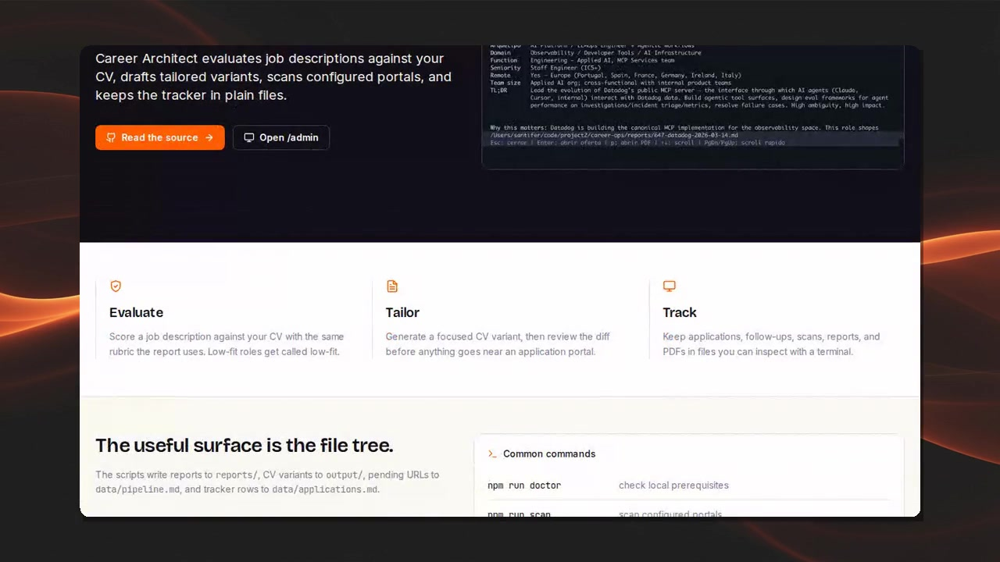
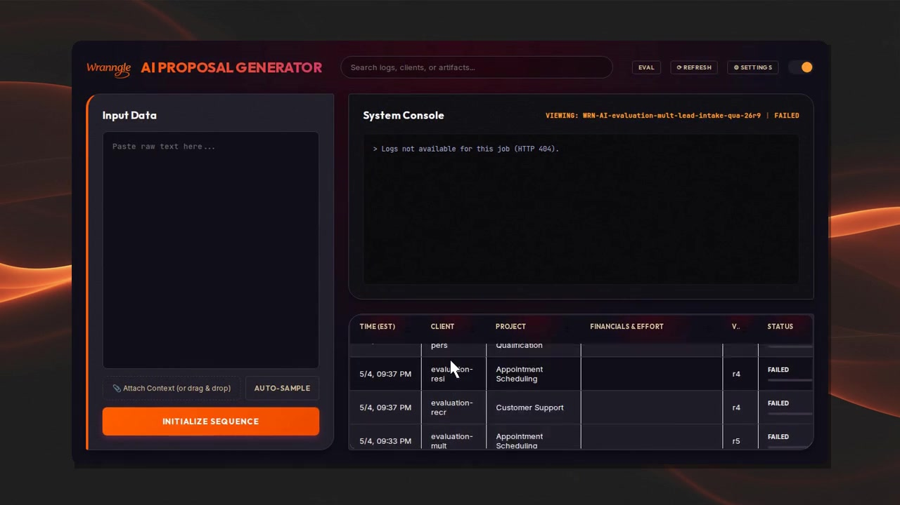
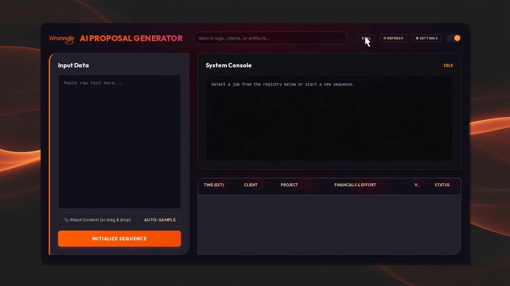
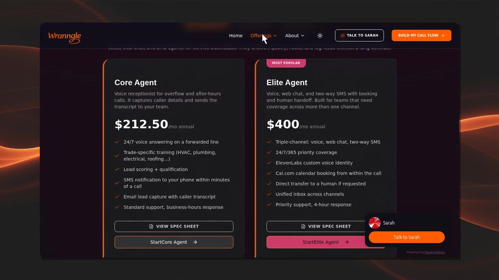
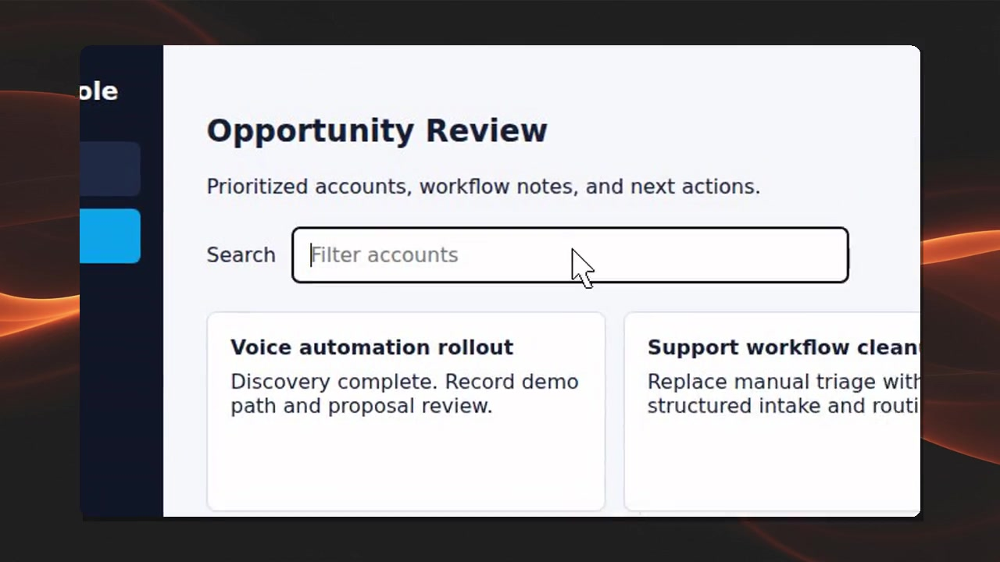

# UI Demos

Auto-recorded with `auto_demo author`. Each directory has the polished
`composed.mp4`, a `flow.demo.json` you can replay with `auto_demo run`,
`metadata.json` with model + token usage, plus `preview.jpg` / `thumbnail.jpg`.

| Repo | Preview | Video | Selector quality |
|---|---|---|---|
| [career_architect](./career_architect/) |  | [composed.mp4](./career_architect/composed.mp4) | n/a (scroll-only) |
| [gtm_ops](./gtm_ops/) |  | [composed.mp4](./gtm_ops/composed.mp4) | 0/6 (downstream a11y debt) |
| [unified-presales-report](./unified-presales-report/) |  | [composed.mp4](./unified-presales-report/composed.mp4) | 1/1 ✅ |
| [wranngle_com](./wranngle_com/) |  | [composed.mp4](./wranngle_com/composed.mp4) | 1/1 ✅ |
| [selector_quality_proof](./selector_quality_proof/) |  | [composed.mp4](./selector_quality_proof/composed.mp4) | 3/3 ✅ |

`selector_quality_proof` is the canonical fixture run that proves author-mode
ships a replayable flow end-to-end. It runs against `examples/fixtures/smoke.html`
and also emits a `composed.gif` (16:9 cropped) via `--format gif --aspect 16:9`.

## Selector quality, plainly

Author-mode's value depends on the agent picking targets by **role + name**, not
by accessibility-tree index. Three things now make that work:

1. The system prompt biases the agent toward role + name.
2. The `click` / `type` / `hover` tools accept `role` and `name` fields directly.
3. When the agent still falls back to index, tool-handlers back-resolves the
   element from the cached accessibility snapshot and fills in role/name/text
   for the emitted flow step.

It works on apps with reasonable ARIA. It does not work on apps where rows
are non-semantic divs — `gtm_ops` is the example in this set. The remaining
TODO selectors there reflect downstream a11y debt in the gtm_ops repo, not
an auto_demo gap.

## Per-repo notes

### career_architect
Next.js landing page (port 3001). Pure scroll demo, agent calls `done` cleanly.

### gtm_ops
Bun + custom server (port 3002). Dashboard with non-semantic table rows.
Agent kept trying different click targets (max-stepped at 14). The video is
useful as a UI walkthrough; the `flow.demo.json` is mostly TODO selectors
because the dashboard rows don't expose stable identifiers.

### unified-presales-report
Bun + Express (port 3003). Clean 2-step demo with a resolved selector.

### wranngle_com
Vite SPA (port 5173). Brief scroll + a single resolved-selector click.

### selector_quality_proof
Minimum-viable proof that author → run round-trips. Also demonstrates
`--format gif` + `--aspect 16:9`.

## Re-running

```bash
auto_demo author <url> \
  --prompt '...' \                    # or omit for --explore default
  --output ./demos/<repo> \
  --max-steps 14 \
  --flow-name <slug>
```

To embed a recording in a README:

```bash
auto_demo embed ./demos/<repo> --relative-to .
```

That prints the markdown + HTML for paste.

## Known limitations

- **a11y-poor UIs**: if a target element has `role=generic` and no accessible
  name and no short text, the flow step is marked `TODO selector` and needs
  a hand-picked Playwright locator.
- **Author-mode video vs. flow**: `composed.mp4` is always valid even when
  `flow.demo.json` has TODOs. The video records what the agent did; the flow
  records what can be replayed. Sometimes one ships without the other.
